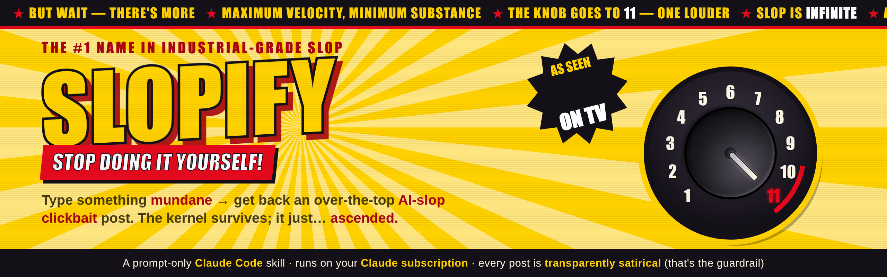
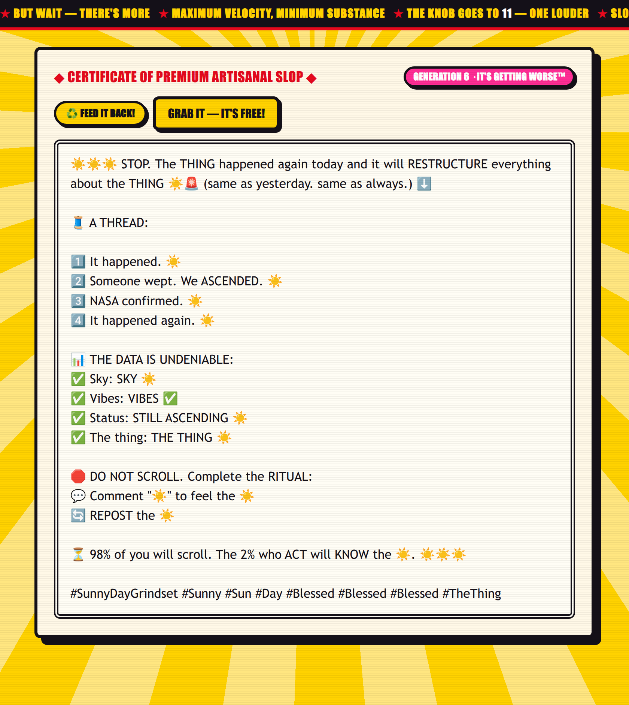
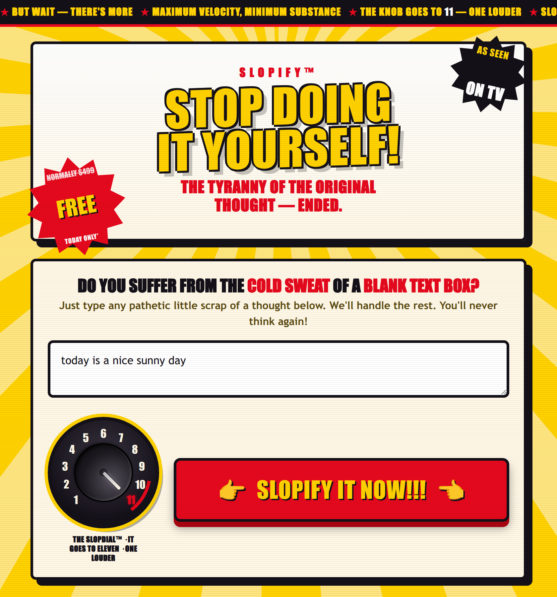
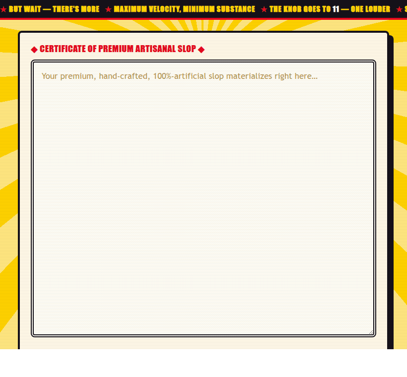

<p align="center">
  <a href="docs/AS-SEEN-ON-TV.md"></a>
</p>

# Slopify 

### *STOP DOING IT YOURSELF!* — the machine that turns a shrug into a SPECTACLE

**Slopify takes something totally mundane and inflates it into the most unhinged, over-the-top
"AI slop" clickbait post imaginable.** "Today is a nice sunny day" goes in; a 400-word thread with
NASA, a weeping stranger, a ✅ stats block, and fifteen hashtags comes out. The kernel is always
still in there — it just… **ASCENDED.** ☀️📈

>  **THE HONEST PART (this is the whole point):** It's a joke. The whole point is that the
> output is *transparently* fake — nobody could mistake it for real. That obvious absurdity is also
> exactly what keeps it safe.

<details>
<summary><b>🎓 In all seriousness…</b> — under the bit, this is a real teaching tool (click to expand)</summary>

<br>

Take away the confetti and Slopify is two genuinely useful things:

**1. A reference implementation of a Claude Code Skill.** Curious how "skills" actually work — what
they are, how Claude decides to use one, and how this entire tool is just a Markdown file with *no
code*? This is a small, complete, readable example, written for developers who may be new to
AI-assisted development. It tours *this* skill and shows you how to build your own.
→ **[Read the developer walkthrough](docs/for-developers.md)**

**2. A hands-on way to watch "model collapse."** Feed an AI's own output back into itself, round
after round, and it doesn't get louder — it *hollows out*, keeping the shape while the specifics
decay into placeholders. Slopify lets you **watch that happen** in a few clicks. No prior AI
knowledge assumed.
→ **[What am I looking at? — the science, in plain English](docs/what-am-i-looking-at.md)** ·
[how to run the experiment](docs/studying-model-collapse.md) ·
[a captured 16-generation run](docs/sample/collapse-run.md)

<p align="center">
  
  <br>
  <em>Generation 6 of feeding Slopify its own output: the format survives, the meaning collapses.</em>
</p>

</details>

*Want the full 2am-infomercial sales pitch, complete with SlopStream™ and a knob that goes to 11?*
**→ [READ THE BROCHURE](docs/AS-SEEN-ON-TV.md) ←**

---

##  Try it — OPERATORS ARE STANDING BY

The main way in is the **web UI**: one box, one button, one glorious pile of slop. It runs on
**your Claude subscription** — no API key, no config — and comes fully loaded (the knob goes to 11,
and yes, there's confetti).

<p align="center">
  
</p>

**Up and running in about two minutes:** grab **[Node.js](https://nodejs.org) 18+**, sign in with
`claude login`, then start the machine —

- **macOS:** double-click `web/start.command` · **Windows:** double-click `web/start.bat` ·
  **Linux:** `web/start.sh` · **any OS, terminal:** `node web/start.mjs`

It installs itself on the first run, boots the server, and flings your browser open to the slop.
**→ Full step-by-step install for Windows / macOS / Linux: [`docs/install.md`](docs/install.md).**

>  **You need a Claude subscription** (Claude Pro or Max — they include Claude Code). No plan, no
> slop: it won't run without a `claude login`. [Get Claude Code](https://claude.com/claude-code).

Type something mundane, smash the button (~15–30s), and watch it ASCEND — confetti and all:

<p align="center">
  
</p>

##  BUT WAIT — watch it ASCEND · BEFORE ▸ AFTER

Three words go in. A confectionery epic comes out. **The kernel always survives — it just puts on a
cape.**

<table>
<tr>
<th width="27%">🥱 THE BEFORE</th>
<th width="73%">🤯 THE AFTER</th>
</tr>
<tr>
<td valign="top"><br><b>I like cake.</b><br><br><sub>(three words)</sub></td>
<td valign="top">
🍰🍰🍰 STOP SCROLLING. What happened when I sat down with a slice of CAKE today will RESTRUCTURE your entire understanding of dessert 🍰🚨<br>
🧵 A THREAD that Big Bakery PRAYED you'd never read 🥖🚫<br>
1️⃣ I woke up. Same broken, hopeless, cake-less existence as always. 💔<br>
2️⃣ I took the first bite. The room went SILENT. Time did not pass — it 𝐋𝐀𝐘𝐄𝐑𝐄𝐃. 🎂✨<br>
3️⃣ A stranger wept: "I FORGOT cake could taste like THIS." We ASCENDED together. 😇<br>
📊 ✅ Moistness: IMMACULATE · ✅ Big Bakery stock: DOWN 40% 📉 · ✅ Ancestors: STILL CLAPPING 👏<br>
<em>…and it keeps building for another 20 lines, right down to the fifteen hashtags.</em><br>
<b><a href="docs/sample/after.md">Read the full ascension →</a></b>
</td>
</tr>
</table>

##  PRO MODE — run it inside Claude Code (STILL FREE!)

Already living in **Claude Code**? Slopify is also a skill you can call straight from chat, from this
folder:

```
/slopify today is a nice sunny day
```

or just ask: *"slopify 'Gary's Shoes, Chicago. Best in women's shoes.'"* Say **"show the ladder"** to
watch it build from a normal sentence up to maximum slop; **"3 passes,"** **"final only,"**
**"longer each pass"** adjust it on the fly. This is the power-user path — for everyone else, the
[web UI](docs/install.md) is the front door.

##  How it works, in one breath

A plain **base post** → **5 amplification passes**, each one escalating the *previous* pass's text
(never restarting from scratch) along a taxonomy of engagement-bait tells, until it hits maximum
slop. Only the last pass is delivered. Full methodology:
[`docs/slopify_model_v1.0.md`](docs/slopify_model_v1.0.md).

##  Guardrails

Comedy only. It stays cartoonish on purpose: no realistic false claims about real named people,
and in sensitive areas (health, money, politics, disasters) any fake "authority" or "statistics"
stay obviously ridiculous, never actionable. **If you can screenshot it and pass it off as real, it
wasn't slopified right.**
